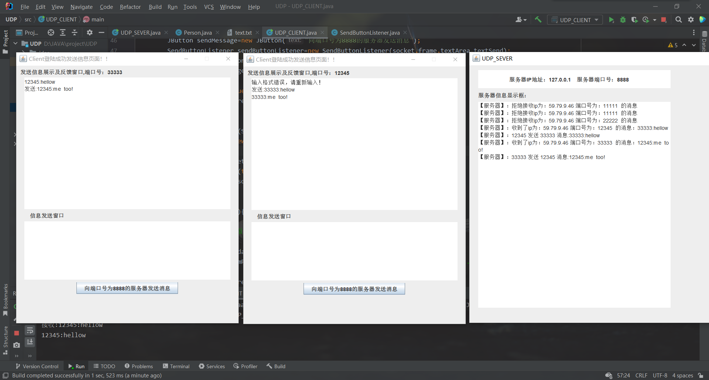

# TCP-JAVA

JAVA实现UDP服务器和客户端通信以及客户端之间进行通信的小Demo,计网socket实验

# 使用方法
1、运行UDP_SEVER文件启动服务器端默认运行在8888端口  
2、查看src文件夹下的text文件（相当于白名单文件），其中规定了服务器允许转发的ip地址和端口号，
修改其中的端口号为本机ip和端口  
3、修改代码中main函数中的port端口号为白名单中的端口，运行UDP_CLIENT文件启动客户端，
再次修改port启动第二个客户端  
4、根据发送规则（端口号:信息）进行客户端通信通信

# 效果预览

2023-9-7

- 新建仓库，上传资源  